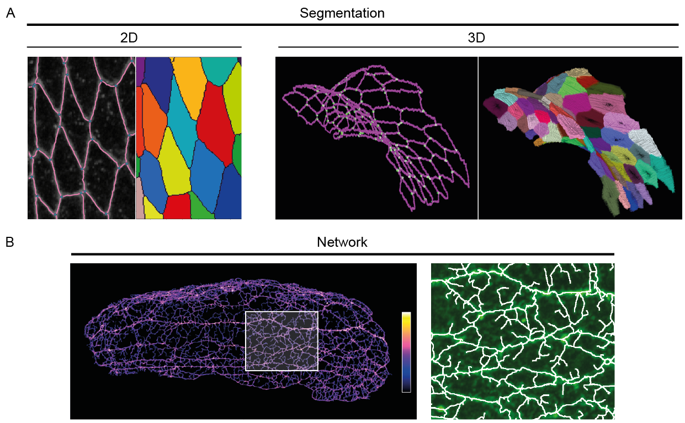

# Dissect : Segmentation and analysis of highly remodeled epithelial surfaces in 3D

Warning : tutorials and link to them are under construction. 

## Overview
`Dissect` library, for DisPerSE-based Segmentation and Exploration of Cells and Tissues, provide a way to segment and analyse apical 3D tissue. Using [DiSperSE](http://www2.iap.fr/users/sousbie/web/html/indexd41d.html) program to generate a skeleton, `Dissect` is able to segment apical surface of tissue on 2D and 3D (Figure 1 A) and provide geometric and signal quantifications. `Dissect` is also able to analyse meshwork signal and provide related analysis (Figure 1 B). Meshwork analysis can be crossed with geometric and/or signal quantification. 
 Dissect can be used with a graphical interface or with your own handmade script. 

***Figure 1 : Overview of differents types of skeleton that can be generated and analyse.***
 *A. Segmentation of tissue on 2D (left) and 3D (right).*
 *B. Analyse of meshwork signal. On right it is a zoom of a small part of the left tissue.*

#### Generate a skeleton
Skeleton is generated by [DisPerSE](http://www2.iap.fr/users/sousbie/web/html/indexd41d.html), a C++ program developed by Thierry Sousbie. 
 We provide a Docker images with DisPerSE already install that you can use on [Docker](https://www.docker.com/). A tutorial of use can be found [here](NOTPROVIDEDYET). 
 You can install directly DisPerSE directly from the source code [here](http://thierry-sousbie.github.io/DisPerSE/). 

#### Analyse a skeleton and/or meshwork
Analysis can be done with the graphical interface or with python script. At the end it provides tables with data, and can generate color-coded images. 

## Documentation
We provide some tutorial for install and use Dissect and DisPerSE : 

* How install and use DisPerSE using docker : [here](NOTPROVIDEDYET).
* How use Dissect with the GUI : [here](NOTPROVIDEDYET).
* How use Dissect with python code : [here](NOTPROVIDEDYET).

### Contact
For any questions or issues, you can open an issue [here](https://github.com/sophietheis/Dissects/issues).

### Authors
* Sophie Theis - @sophietheis
* Tatiana Merle - @TatiaM
* Emmanuel Martin
* Alain Kamgoué
* Florian Sarron
* Guillaume Gay - @glyg
* Magali Suzanne

### Dependencies
* Python >= 3.6
* Numpy
* Scipy
* Matplotlib
* Pandas
* Jupyter
* Notebook
* exifread
* opencv
* tifffile >= 2021.8.3

## Install
See [INSTALL.md](INSTALL.md) for a step by step install. 

## Licence

This project is distributed under the terms of the [General Public Licence](https://www.gnu.org/licenses/gpl.html).

Versions 2.4 and earlier were distributed under the [Mozilla Public Licence](https://www.mozilla.org/en-US/MPL/2.0/).

If GPL licencing is too restrictive for your intended usage, please contact the maintainer.

